<div align="center">

<a href="https://dhruvgupta.co">
<picture>
  <source media="(prefers-color-scheme: light)" srcset="dhruv-portfolio/docs/readme/banner-light.svg">
  
</picture>
</a>

<picture>
  <source media="(prefers-color-scheme: light)" srcset="dhruv-portfolio/docs/readme/stack-light.svg">
  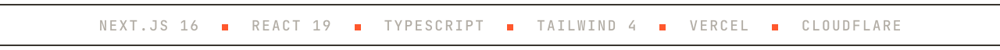
</picture>

</div>

<h3><picture>
  <source media="(prefers-color-scheme: light)" srcset="dhruv-portfolio/docs/readme/h-preview-light.svg">
  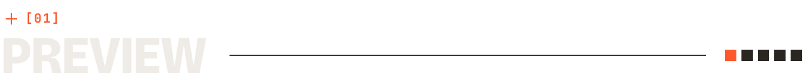
</picture></h3>

<picture>
  <source media="(prefers-color-scheme: light)" srcset="dhruv-portfolio/docs/screenshots/home-light.jpg">
  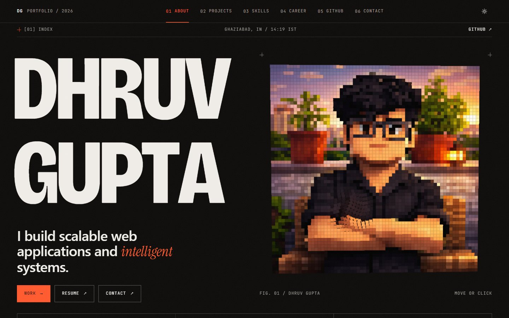
</picture>

<table>
  <tr>
    <td width="50%">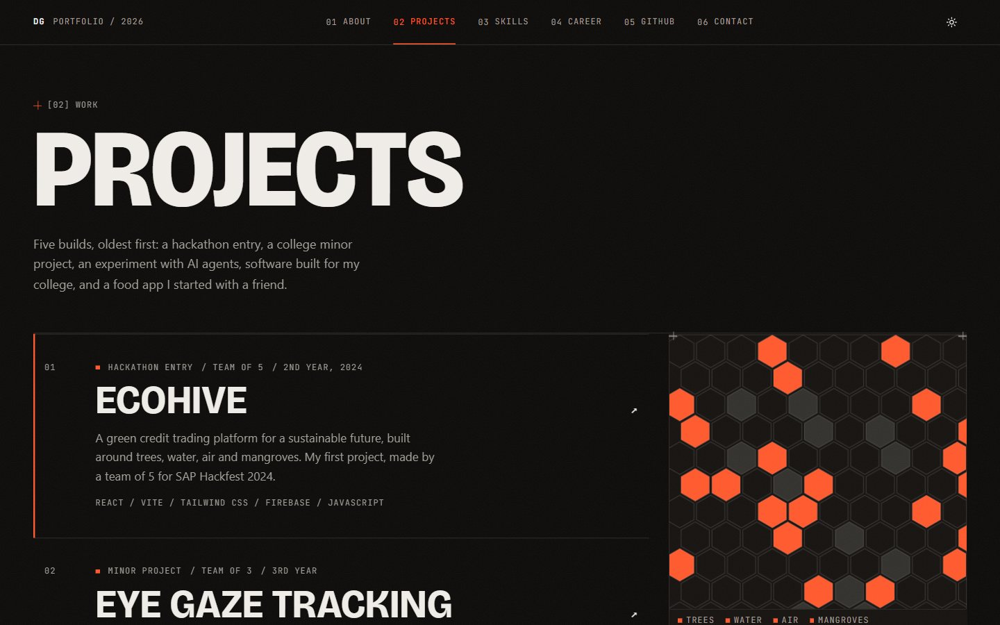</td>
    <td width="50%">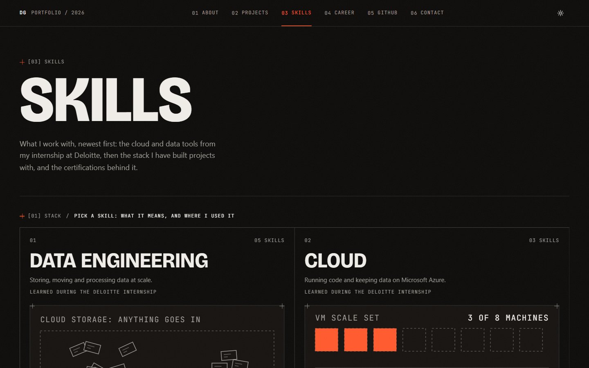</td>
  </tr>
  <tr>
    <td width="50%">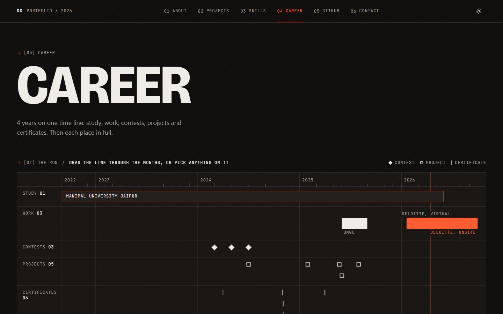</td>
    <td width="50%">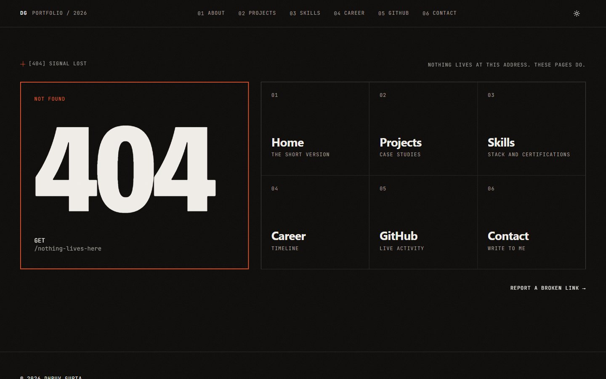</td>
  </tr>
</table>

<h3><picture>
  <source media="(prefers-color-scheme: light)" srcset="dhruv-portfolio/docs/readme/h-highlights-light.svg">
  
</picture></h3>

<picture>
  <source media="(prefers-color-scheme: light)" srcset="dhruv-portfolio/docs/readme/highlights-light.svg">
  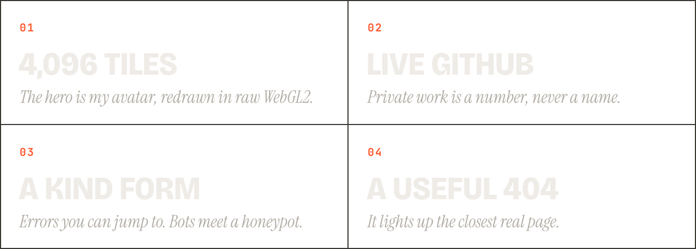
</picture>

<h3><picture>
  <source media="(prefers-color-scheme: light)" srcset="dhruv-portfolio/docs/readme/h-design-light.svg">
  
</picture></h3>

<picture>
  <source media="(prefers-color-scheme: light)" srcset="dhruv-portfolio/docs/readme/themes-light.svg">
  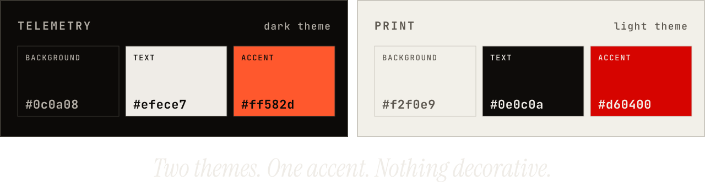
</picture>

<h3><picture>
  <source media="(prefers-color-scheme: light)" srcset="dhruv-portfolio/docs/readme/h-start-light.svg">
  
</picture></h3>

```bash
git clone https://github.com/Dhruv-413/Dhruv.git      # Node.js 20.9 or later
cd Dhruv/dhruv-portfolio
npm install
cp .env.example .env.local                            # then fill it in, below
npm run dev                                           # http://localhost:3000
```

```bash
# .env.local
NEXT_PUBLIC_EMAILJS_PUBLIC_KEY=     # required, even to build (placeholders are fine)
NEXT_PUBLIC_EMAILJS_SERVICE_ID=     # required
NEXT_PUBLIC_EMAILJS_TEMPLATE_ID=    # required
GITHUB_TOKEN=                       # optional, server-only: powers /github
GITHUB_USERNAME=Dhruv-413           # optional
NEXT_PUBLIC_SITE_URL=               # production address, no trailing slash
```

<h3><picture>
  <source media="(prefers-color-scheme: light)" srcset="dhruv-portfolio/docs/readme/h-more-light.svg">
  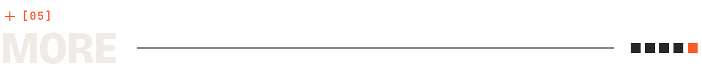
</picture></h3>

<details>
<summary><b>Contact email (EmailJS)</b></summary>

Paste [`emailjs-contact-template.html`](dhruv-portfolio/docs/emailjs-contact-template.html) into your EmailJS template. Set **Subject** to `Portfolio: {{subject}}`, **From Name** to `{{name}}` and **Reply To** to `{{email}}`. In the dashboard, limit allowed origins and turn on rate limiting.

</details>

<details>
<summary><b>Change the content</b></summary>

- `dhruv-portfolio/src/data/*.json`: projects, skills, timeline, certificates
- `dhruv-portfolio/src/lib/constants.ts`: name, links, email, availability
- `dhruv-portfolio/public/Dhruv_resume.pdf`: résumé

</details>

<details>
<summary><b>Deploy</b></summary>

Vercel, from `main`, with the domain on Cloudflare. For your own copy: set the Root Directory to `dhruv-portfolio`, add the variables above, then add your domain in Vercel and its DNS records in Cloudflare.

</details>

<details>
<summary><b>Where things live</b></summary>

```text
dhruv-portfolio/
├── DESIGN.md              # design contract and decision log
├── docs/                  # EmailJS template, README art
├── public/                # résumé, portrait, manifest, app icons
└── src/
    ├── app/               # routes, metadata, icons, share images
    ├── components/        # features/, shared/, ui/
    ├── data/              # content as JSON
    └── lib/               # github/, schema/, email/, constants.ts
```

</details>

<picture>
  <source media="(prefers-color-scheme: light)" srcset="dhruv-portfolio/docs/readme/footer-light.svg">
  
</picture>
